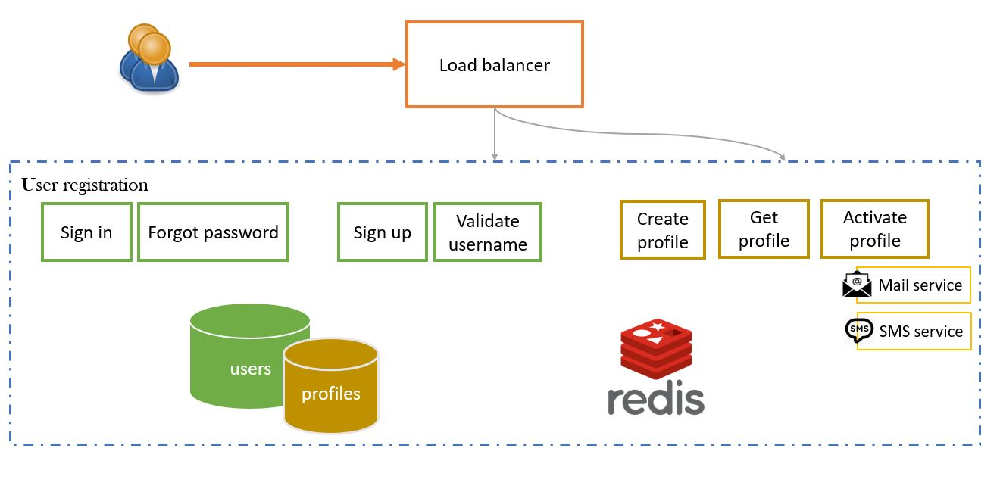
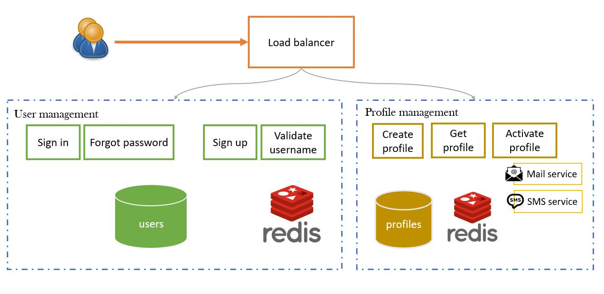

# User Registration

  
   

User registration is broken into 2 microservices:
* [User management](#user-management)
* [Profile management](#profile-management)

  
   

## Overview
This is template which cover the basic infrastructure of a microservice.

From a technical stance, the codebase contains the following:
 * REST Endpoints using spring boot
 * Reactive web-stack (endpoints to persistence)
 * Working with docker container & integration

From a feature stance, some feature which ensure the scalability, high availability, reliability & service abuse.
 * Rate limiting prevents DOS attacks, resource overuse leading to microservice crash etc.
 
### User Management
This microservice will
### Profile Management

### Scalability
* [Rate limiter](#rate-limiter)

#### Rate limiter
Scaling a service can broadly be placed into 2 catagories, which would be:
* Protecting client side resources
* Protecting server side resources

The role of circuit breaker is to protect the client from being dragged down by external service issues and always respond quickly (even if an error is encountered, its better than waiting for long) The key is always avoid excessive consumption of resources.
On the other hand, rate limiter protects the service from consuming requests beyond its targeted capacity within a given timeframe.
Then there are other techniques like bulkhead, retry which support either or both of the above. 

Rate limiting is a popular technique to prepare an API for scale and establish high availability of the service. The service can simply decline, queue up the request and invoke them later or a combination of both the approaches. ([internals](https://resilience4j.readme.io/docs/ratelimiter) | [example](https://resilience4j.readme.io/docs/examples-4))
If you're looking to design rate limiter & data modelling, refer this [article](https://medium.com/@saisandeepmopuri/system-design-rate-limiter-and-data-modelling-9304b0d18250).

Bulkhead allows the service to consume multiple request and process them with separate thread using the thread instantiated in the thread pool.

#### Introduction to Resilience4j

[Resilience4j](https://resilience4j.readme.io/docs/getting-started) is a lightweight, easy-to-use fault tolerance library inspired by [Netflix Hystrix](https://github.com/Netflix/Hystrix)

Resilience4j provides higher-order functions (decorators) to enhance any functional interface, lambda expression or method reference with a Circuit Breaker, Rate Limiter, Retry or Bulkhead. You can stack more than one decorator on any functional interface, lambda expression or method reference. The advantage is that you have the choice to select the decorators you need and nothing else.

With Resilience4j you don’t have to go all-in, you can pick what you need.

[more...](https://resilience4j.readme.io/docs/getting-started)

## Deployment 
### Host a MySQL server in a docker container
* Creating a network
    > docker network create users-mysql-client-network

* Starting a MySQL server instance 
    > docker run -p 3307:3306 --name users-mysql-server -e MYSQL_ROOT_PASSWORD=root -e MYSQL_DATABASE=users -e MYSQL_USER=user -e MYSQL_PASSWORD=password -d mysql:latest

    ... where user-mgmt-mysql is the name you want to assign to your container, password is the password to be set for the MySQL root user and tag is the tag specifying the MySQL version you want. [See the list above for relevant tags](https://hub.docker.com/_/mysql).

### Hosting a redis container
  * Download image for redis
     > docker pull redis
  * Run the docker image, expose it to port xxx
    Without persistence 
     > docker run -p 9091:9091 --name users-redis-instance

    With persistence
     > docker run -p 9091:9091 --name users-redis-instance -d redis redis-server --appendonly yes

### Setting up user-registration microservice in a docker container ([Reference](https://www.youtube.com/watch?v=fvEWoy1xOvo))

  * Build docker image using Dockerfile in root location of project 
    > docker build . -t user-registration-0.0.1-snapshot
  * Run the docker image in a new container, expose server port using '9876:9876', link it to mysql-server container using image 'user-registration-0.0.1-snapshot'                                                                       
    > docker run -p 9876:9876 --name user-registration --link users-mysql-server:mysql --link user-redis-instance:redis -d user-registration-0.0.1-snapshot
  * Loading setup.sql & test-data.sql 
    > docker exec -it users-mysql-server /bin/bash
    bash# mysql -uroot -p -A
    Enter password: xxxx
    mysql> select ...

## Useful commands
  * Docker commands
     * Start docker container
        > docker start user-registration
     * Stop docker container
        > docker stop user-registration
     * Restart docker container
        > docker restart user-registration
     * View logs
        > docker logs user-registration
